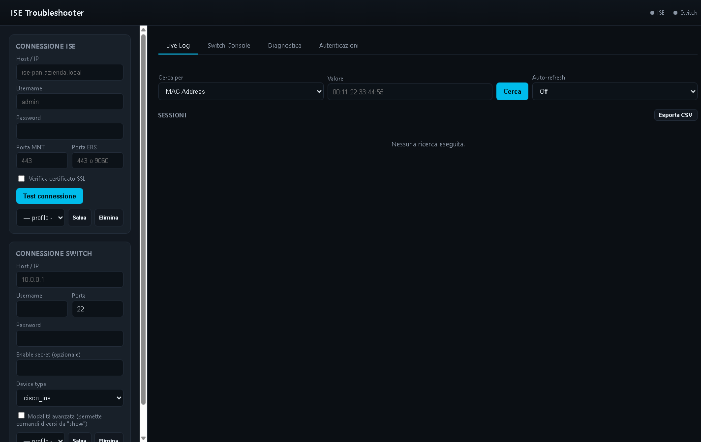

# 🛰️ Cisco ISE Troubleshooter

Web app locale per il troubleshooting live di autenticazioni **802.1X / MAB** su Cisco ISE: ricerca sessioni per MAC/username via API **MNT**, contesto endpoint via API **ERS**, **CoA** (Reauth/Disconnect), storico autenticazioni correlato con le azioni CoA, e comandi diagnostici via **SSH** sugli switch (Netmiko).

Backend FastAPI + frontend HTML/JS a file singolo: **nessuna build, nessuna installazione lato utente finale** — un solo `.exe` e via.



## ✨ Funzionalità

| Area | Cosa fa |
|---|---|
| **Live Log** | Ricerca sessioni per MAC, username o elenco sessioni attive; storico pass/fail delle ultime 24h con motivo di fallimento; contesto endpoint (ERS); cronologia ricerche recenti; export CSV. |
| **Autenticazioni** | Watchlist di MAC/utenti (auto-popolata dalle ricerche in Live Log), storico autenticazioni aggregato e filtrabile (solo falliti, per NAS, per motivo di fallimento), correlato con le azioni CoA lanciate dall'app stessa. |
| **CoA** | Reauth e Disconnect delle sessioni direttamente dai risultati, con conferma esplicita prima dell'invio e registro locale delle azioni. |
| **Switch Console** | Comandi SSH su switch (Netmiko) con comandi rapidi predefiniti; solo comandi `show` permessi di default (guardrail anti config-mode), "modalità avanzata" attivabile per il resto. |
| **Diagnostica completa** | Verdetto automatico che incrocia sessione ISE, storico autenticazioni, contesto ERS e output switch; export in Markdown pronto per un ticket. |
| **Profili salvati** | Credenziali ISE/switch (host + username, mai la password) salvabili in locale per riuso rapido. |
| **Audit log** | Ogni CoA e comando switch eseguito viene registrato su file (`backend/audit.log`) con timestamp, host/utente e comando. |
| **Auto-refresh** | Aggiornamento automatico configurabile della Live Log. |

## 🔒 Sicurezza

- Le password ISE/switch **non vengono mai scritte su disco** (né in log, né nei profili salvati): restano solo in memoria di sessione del browser e vengono inviate al backend a ogni richiesta, che non le persiste.
- I profili salvati in locale contengono solo host e username, mai la password.
- I comandi switch eseguibili da console sono limitati ai comandi `show`, a meno di attivare esplicitamente la modalità avanzata.
- Ogni azione CoA e ogni comando switch vengono tracciati in `backend/audit.log`.

## 📋 Requisiti

- Accesso di rete a ISE (API MNT/ERS) e agli switch (SSH).
- Solo per l'uso da sorgente: Python 3.11+.
- Solo per generare l'eseguibile: Python 3.11+ e PyInstaller.

## 🚀 Installazione ed utilizzo

Ci sono due modi per usare la soluzione: come **eseguibile standalone** (consigliato per un utente finale, es. tecnico dal cliente, nessun Python richiesto) oppure **da sorgente** (per sviluppo/debug).

### Opzione A — Eseguibile standalone (.exe)

Se hai già un `IseTroubleshooter.exe` (es. dalla cartella `backend/dist/` o da una [Release](../../releases) del repository):

1. Copia `IseTroubleshooter.exe` su una qualsiasi macchina Windows con accesso di rete a ISE e agli switch (non serve installare nulla, Python incluso).
2. Fai doppio clic sull'eseguibile (o lancialo da riga di comando).
3. Si apre automaticamente il browser su `http://127.0.0.1:8000` con l'interfaccia pronta all'uso.
4. Inserisci le credenziali ISE (e switch, se necessario) nel pannello laterale e inizia la ricerca.
5. Il file `audit.log` con la cronologia delle azioni (CoA e comandi switch) viene creato nella stessa cartella dell'eseguibile.

Per chiudere l'applicazione, chiudi la finestra della console dell'eseguibile.

### Opzione B — Da sorgente (sviluppo)

```bash
cd backend
python -m venv venv
venv\Scripts\activate      # Windows
pip install -r requirements.txt
python -m uvicorn main:app --port 8000
```

Poi apri http://127.0.0.1:8000. Su Windows puoi anche lanciare `avvia.bat` dalla root del progetto, che crea il virtualenv, installa le dipendenze e avvia il server automaticamente.

## 🏗️ Come generare l'eseguibile (.exe)

Per distribuire la soluzione a chi non ha Python installato, genera un eseguibile standalone con PyInstaller:

```bash
cd backend
python -m venv venv
venv\Scripts\activate
pip install -r requirements.txt
pip install pyinstaller
pyinstaller IseTroubleshooter.spec
```

Al termine, l'eseguibile si trova in `backend/dist/IseTroubleshooter.exe`. È un file unico e autocontenuto (frontend incluso): basta copiarlo sulla macchina di destinazione, senza bisogno di installare Python, dipendenze o altro.

Nota: lo `.exe` va generato sullo stesso sistema operativo su cui verrà eseguito (build su Windows → eseguibile per Windows).

## 📁 Struttura

```
backend/
  main.py            # route FastAPI
  ise_client.py       # client API MNT/ERS (ISE)
  switch_client.py    # client SSH switch (Netmiko)
  audit_log.py         # log di audit locale (mai password)
  run.py               # entry point per l'eseguibile PyInstaller
  tests/               # test del parsing XML
frontend/
  index.html           # UI single-page (no build step)
  assets/               # screenshot e risorse statiche
```
